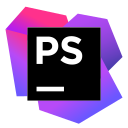

### Hi there 👋

I'm Max, a web developer.

🌟 I'm committed to writing clean, well-documented code and following best practices to ensure code quality and maintainability throughout the development lifecycle. I pay close attention to code architecture, naming conventions, and code structure to ensure that my projects are easy to understand and maintain by myself and fellow developers

📚 Continuously learning and exploring emerging technologies in the PHP ecosystem, I'm excited about staying updated with the latest trends and incorporating innovative solutions to solve real-world problems.

 

#### Languages and tools

<!--
Icons sources:
- BW: https://simpleicons.org/?q=git
- Colour: https://devicon.dev/

**MaxLZp/MaxLZp** is a ✨ _special_ ✨ repository because its `README.md` (this file) appears on your GitHub profile.

Here are some ideas to get you started:

- 🔭 I’m currently working on ...
- 🌱 I’m currently learning ...
- 👯 I’m looking to collaborate on ...
- 🤔 I’m looking for help with ...
- 💬 Ask me about ...
- 📫 How to reach me: ...
- 😄 Pronouns: ...
- ⚡ Fun fact: ...
-->
